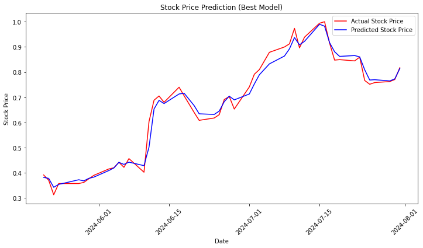

# Stock Price Prediction with Sentiment Analysis using LSTM

This project demonstrates how to predict stock prices using Long Short-Term Memory (LSTM) models by combining stock price data from Yahoo Finance with sentiment analysis of financial news data. The sentiment analysis is performed using the FinBERT model, which is specifically tuned for financial text.

## Project Overview

The goal of this project is to build a model that predicts future stock prices by taking into account both historical price data and sentiment derived from financial news articles. The project follows these main steps:

1. **Fetch Stock Data**: Retrieve historical stock price data for a given ticker symbol using Yahoo Finance.
2. **Fetch Sentiment Data**: Collect financial news articles related to the stock and analyze the sentiment using FinBERT.
3. **Combine Data**: Merge the stock data with the sentiment data to create a comprehensive dataset.
4. **Scale Features**: Prepare the data for modeling by scaling the features and calculating moving averages.
5. **Prepare Data for LSTM**: Reshape the data to be compatible with LSTM models.
6. **Build and Train LSTM Model**: Use Keras and Keras Tuner to build, train, and optimize an LSTM model.
7. **Evaluate and Plot**: Evaluate the model's performance and visualize the predicted vs. actual stock prices.

## Requirements

To run this project, you will need the following Python libraries:

- `yfinance`
- `pandas`
- `finnhub`
- `transformers`
- `sklearn`
- `numpy`
- `keras`
- `keras-tuner`
- `matplotlib`

## Data Sources

### Stock Price Data:
The stock price data is fetched using the yfinance library, which provides an easy-to-use interface for downloading historical market data from Yahoo Finance.

### Sentiment Data:
The sentiment data is derived from financial news articles using the FinBERT model. News articles are fetched using the Finnhub API.

#### Tip: 
You can replace the Finnhub API with any other API that provides financial news data, depending on your requirements and preferences.

## Results:
The following plot shows the comparison between the actual and predicted stock prices for AAPL over a one-year period:

As seen in the plot, the model effectively captures the trends in stock prices, though some discrepancies are present, which could be further refined with additional tuning and data.

